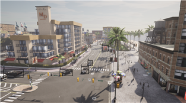
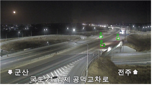

# 비정상 주행 탐지 (Recognization of car abnormal driving)

## Carla_sim
- Recognition 모델의 학습 데이터를 carla 시뮬레이션으로부터 생성  

  
  

## Classification
- CCTV 영상으로부터 전체 프레임을 통해 해당 영상이 어떤 비정상 주행에 대한 영상인지 분류  
(예시사진)

## Recognition
- CCTV 영상으로부터 매 프레임의 영상마다 주행 객체(차량)을 탐지하고 해당 객체가 어떠한 비정상 주행을 하고 있는지 판별  

  
  
방향지시등 미사용 차선 변경

  
  
실선구간 차선변경

  
  
동시 차로변경

 

  
  
안전거리 미확보 차선변경

  
  
정체구간 차선변경

  
  
2개차로 연속변경

 