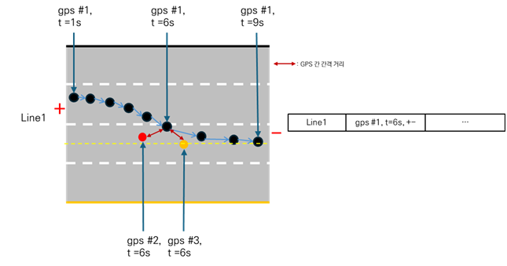
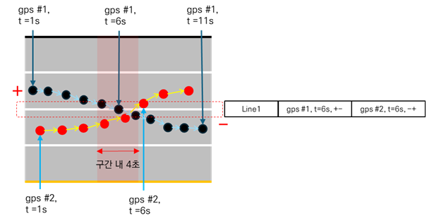
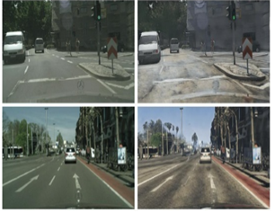

# Generating training dataset by using Carla simulation based on HD map, GPS point GTs

## 시뮬레이션 - 실제 영상 비교 예시

  
  

## 시뮬레이션 환경 설정
1. 도로 환경 설정
2. 주행 환경 설정 (도로 환경 설정 + 법규 위반 주행 라벨링 매칭)

## 법규 위반 주행 라벨링 예시 

  
  

## domain adaptation을 위한 이미지 변환 (simulation to real-world image)

- 이미지 변환 예시 (실제영상 -> 시뮬레이션 영상)

--- 
# 학습 모델: Cycle GAN

### Cycle GAN을 활용한 이미지 변환 수행

